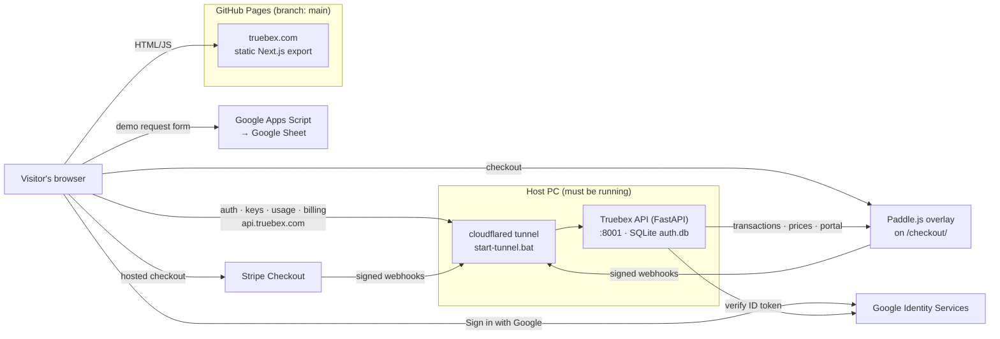

# Truebex

Website, account portal and developer API for **Truebex — True Building
Experience**, live at **https://truebex.com**.

Truebex itself is a desktop building design platform: measured daylight,
self-arranging surfaces, assets that update everywhere. This repo is everything
around it on the web:

- **Marketing site:** a static Next.js export on GitHub Pages.
- **Dashboard:** sign in with Google or email, manage API keys, see usage, and handle billing.
- **API server** (`server/`, FastAPI): accounts, API keys, usage metering, and billing through the UK company (Paddle as reseller by default, Stripe with Stripe Tax as the alternative), served at `api.truebex.com` through a Cloudflare tunnel.
- **Demo-request form:** writes to a Google Sheet via Apps Script.

> **Two repos, one GitHub project.** This folder (`X:\Truebex`, branch
> `master`) is the **source**. The live site is the **build output**, which lives
> in a separate clone (`X:\Truebex_site_files\Truebex`, branch `main`). GitHub
> Pages serves `main`. Read [Deployment](#deployment) before you change anything.

---

## Contents

- [Architecture](#architecture)
- [Repository layout](#repository-layout)
- [Branches](#branches)
- [Local development](#local-development)
- [Environment variables](#environment-variables)
- [Deployment](#deployment)
- [API server](#api-server-server)
- [Google sign-in](#google-sign-in)
- [API keys and usage](#api-keys-and-usage)
- [Billing: Paddle and Stripe](#billing-paddle-and-stripe)
- [Brand, content and SEO](#brand-content-and-seo)
- [Demo request form](#demo-request-form)
- [Known issues](#known-issues)

---

## Architecture



The site is fully static, so `NEXT_PUBLIC_*` URLs are **baked in at build
time**. Anything that switches on later (the Google client ID and the payment
providers) is read from the API at runtime through `/config` and
`/billing/plans`. Turning those on needs only `server/.env` and a server
restart, not a rebuild.

---

## Repository layout

```
src/
  app/
    page.tsx               Landing page (+ SoftwareApplication & FAQPage JSON-LD)
    layout.tsx             Global metadata, fonts, Organization JSON-LD, verification tags
    pricing/               Plans from server/app/catalogue.json (+ comparison, FAQ)
    features/[slug]/       One page per search cluster (FEATURE_PAGES)
    roadmap/ changelog/    Roadmap (src/content/roadmap.json); changelog + feed.xml
    ar/                    Arabic landing page (RTL; lang/dir set by scripts/postbuild-lang.mjs)
    login/ signup/         Auth pages (Google + email)
    dashboard/             Signed-in area: overview, keys/, usage/, billing/, admin/growth/
    developers/            Public API docs (indexable)
    account/               Redirect to /dashboard/ (old URL)
    sitemap.ts robots.ts manifest.ts icon.svg apple-icon.png favicon.ico
  components/
    brand/Logo.tsx         Lockup / LogoMark / Wordmark from the Figma masters
    sections/              Landing sections (Hero, CoreFeatures, Pricing, FAQ, …)
    dashboard/             Shell (auth guard, nav), UsageChart, UsageMeter
    auth/                  AuthForm, GoogleButton, ProfileMenu
  lib/
    constants.ts           ALL site copy: features, pricing, feature pages, Arabic, FAQ, SITE
    catalogue.ts           Plan catalogue types, price formatting, JSON-LD offers
  content/                 roadmap.json, history.json, releases.json (changelog)
    api.ts                 fetch wrapper, session token, date helpers
    auth.ts                accounts + Google sign-in
    developer.ts           keys, usage, billing calls
public/
  brand/                   SVG media kit (mark + wordmark, grey/white/dark)
  images/product/          In-app captures (generated)
  images/og-image.jpg      1200×630 social card (generated)
scripts/make_web_assets.py Regenerates brand assets from the Unreal project
scripts/postbuild-lang.mjs <html lang="ar" dir="rtl"> for out/ar/ (part of npm run build)
scripts/sync-roadmap.mjs   Roadmap statuses from the two trackers (owner, before a deploy)
scripts/indexnow.mjs       Ping IndexNow with changed URLs (owner, after a deploy)
server/
  app/
    main.py                App + routers
    routers/               auth, keys, usage, billing, v1 (developer API)
    billing/               service.py (plan state) · base.py (BillingProvider) · paddle_, stripe_, wayl_provider.py · jobs.py
    models.py database.py  SQLAlchemy models + additive SQLite migrations
    catalogue.json         Tiers, entitlement matrix, prices per interval and currency, founding offer (read by the site at build time)
    plans.py               Reads catalogue.json: prices, request quotas, key limits
    tasks.py               Background jobs (@periodic)
    growth/                Admin growth counts (sign-ups, downloads, trials, checkouts)
  scripts/sync_prices.py   Mirrors catalogue prices to Paddle or Stripe
  tests/                   pytest suite (+ mock_paddle.py, mock_wayl.py for click-through tests)
.claude/skills/            truebex-brand-voice · truebex-seo · truebex-deploy
google-apps-script/        Code.gs for the demo-request sheet
deploy-to-server.bat       Build → copy into the deploy repo → commit → push
start-server.bat           API on 127.0.0.1:8001 (creates the venv on first run)
start-tunnel.bat           cloudflared: api.truebex.com → :8001
```

---

## Branches

| Branch | Local clone | Contains | Notes |
|---|---|---|---|
| `master` | `X:\Truebex` | **Source code** | Commit your work here. |
| `main` | `X:\Truebex_site_files\Truebex` | **Built site** + `.github/` | Default branch. Every push deploys to GitHub Pages. Never edit by hand. |
| `gh-pages` | — | An old build (May 2026) | **Stale, not served.** Safe to delete. |

---

## Local development

**Requirements:** Node.js 20+ and Python 3.12. Use 3.12 specifically, because the
pinned server dependencies don't install on 3.14.

```bash
npm install
cp .env.example .env.local          # fill in the values (see below)

# API (separate terminal): creates server/.venv on first run, serves :8000
server\run.bat
```

> **Don't use `npm run dev` on this machine.** Turbopack's dev server spawned
> hundreds of PostCSS workers and used up all RAM. Test with a production build
> instead:
>
> ```bash
> NEXT_PUBLIC_AUTH_URL=http://127.0.0.1:8000 npm run build
> cd out && py -3.12 -m http.server 3001
> ```
>
> Then run the API with `CORS_ORIGINS=http://localhost:3001`. Rebuild with
> production URLs before deploying.

Server tests: `server\.venv\Scripts\python.exe -m pytest -q` (run from `server/`).

---

## Environment variables

### Frontend: `.env.local` (template: [`.env.example`](.env.example))

| Variable | Purpose | Production value |
|---|---|---|
| `NEXT_PUBLIC_AUTH_URL` | API base URL | `https://api.truebex.com` |
| `NEXT_PUBLIC_SHEETS_URL` | Apps Script web app URL for the demo form | `https://script.google.com/macros/s/…/exec` |

These end up in the public JavaScript, so never put secrets in them.

### API: `server/.env` (template: [`server/.env.example`](server/.env.example))

| Variable | Purpose |
|---|---|
| `SECRET_KEY` | Signs session JWTs. Long random string. |
| `ACCESS_TOKEN_EXPIRE_MINUTES` | Session lifetime (default 1440 = 24 h) |
| `DATABASE_URL` | SQLite file (default `sqlite:///./auth.db`) |
| `CORS_ORIGINS` | Must include `https://truebex.com,https://www.truebex.com` |
| `SITE_URL`, `API_URL` | Public URLs used in checkout redirects and webhook URLs |
| `GOOGLE_CLIENT_ID` | OAuth Web client ID. Empty hides the Google button. |
| `BILLING_PROVIDER` | `paddle` (default) or `stripe`: the provider checkout uses |
| `PADDLE_ENV`, `PADDLE_API_KEY`, `PADDLE_WEBHOOK_SECRET`, `PADDLE_CLIENT_TOKEN` | `sandbox`/`production`; key and webhook secret enable Paddle; the client token (public) is served by `/config` for Paddle.js |
| `PADDLE_API_BASE` | Optional override of Paddle's API host (the local mock) |
| `STRIPE_SECRET_KEY`, `STRIPE_WEBHOOK_SECRET` | Both enable Stripe |
| `STRIPE_PRICE_PRO` | The original monthly Pro price: existing subscribers keep Pro |
| `STRIPE_TAX_ENABLED` | `true` turns on Stripe Tax (`automatic_tax`) |
| `BACKGROUND_TASKS` | `inline` (default), `worker` or `off`: the billing jobs |
| `WAYL_ENABLED`, `WAYL_API_KEY`, `WAYL_WEBHOOK_SECRET`, `WAYL_ENV`, `WAYL_PRICE_PRO_IQD` | Dormant rail: off unless `WAYL_ENABLED=true`; never offered on the site |

---

## Deployment

```
master (X:\Truebex) ──npm run build──▶ out/ ──copy──▶ main (X:\Truebex_site_files\Truebex) ──push──▶ GitHub Pages
```

1. Commit and push `master`.
2. Make sure `.env.local` holds the **production** URLs.
3. Run **`deploy-to-server.bat`**. It builds, backs up the deploy folder,
   replaces everything except `.git`/`.github` with `out/`, commits, and pushes `main`.
4. Watch the "Deploy static content to Pages" run under the repo's **Actions** tab.

The full checklist, including how to verify the live site, is in
[`.claude/skills/truebex-deploy/SKILL.md`](.claude/skills/truebex-deploy/SKILL.md).

**Gotchas**

- **Git "dubious ownership" in the deploy folder.** Run `git config --global --add safe.directory X:/Truebex_site_files/Truebex` once. This is already done on this PC.
- **Custom domain.** Set in the repo's *Settings → Pages* (`main` has no `CNAME`).
- **Paths.** `next.config.ts` relies on `trailingSlash: true` and `assetPrefix: "/"` for nested routes on Pages.

---

## API server (`server/`)

FastAPI + SQLAlchemy + SQLite. Passwords use bcrypt, and sessions are JWTs kept
in `localStorage`. New columns are added on startup by
`database._ADDED_COLUMNS`. These migrations are additive only, so back up
`auth.db` first. Interactive API docs are served at `https://api.truebex.com/docs`.

| Method | Path | Auth | Purpose |
|---|---|---|---|
| GET | `/health` | — | Liveness → `{"status":"ok"}` |
| GET | `/config` | — | Public feature flags (Google client ID) |
| POST | `/auth/register` · `/auth/login` | — | Email/password → session token |
| POST | `/auth/google` | — | Google ID token → session token (signs up, signs in, or links) |
| GET | `/auth/me` | session | Current user |
| GET / POST / DELETE | `/keys`, `/keys/{id}` | session | List, create (key shown once), revoke |
| GET | `/usage` | session | This month: total, limit, daily, by endpoint, by key |
| GET | `/billing/plans` | — | Tiers, prices per interval and currency, founding offer, checkout provider |
| GET | `/billing/subscription` · `/billing/payments` | session | Tier, interval, seats, renewal; payment history |
| POST | `/billing/checkout` | session | `{tier, interval, currency, seats, coupon?, consent}` → checkout URL |
| POST | `/billing/payments/{ref}/refresh` | session | Re-check a payment with its provider |
| POST | `/billing/seats` · `/billing/change` | session | Seats, or tier / interval, prorated |
| GET | `/billing/invoices` | session | Invoices with PDF links |
| POST | `/billing/portal` | session | The provider's customer portal |
| POST | `/billing/webhooks/paddle` · `/stripe` · `/wayl` | provider | Payment events (`/wayl` only with `WAYL_ENABLED`) |
| GET | `/v1/ping` · `/v1/account` | **API key** | Developer API (metered) |
| GET | `/admin/growth?from=&to=` | session, admin | Sign-ups, downloads, trials, checkouts, paid per UTC day (counts only) |

### Running in production

The API runs **on the host PC**:

1. `start-server.bat` serves the API on `127.0.0.1:8001`.
2. `start-tunnel.bat` runs the cloudflared tunnel `win-tunnel`
   (`%USERPROFILE%\.cloudflared\config.yml`), which routes `api.truebex.com → localhost:8001`.

If either one stops, `https://api.truebex.com/health` returns **HTTP 530 /
Cloudflare error 1033**. Login and the dashboard then stop working, but the rest
of the site is unaffected. The dashboard shows a "can't reach the server"
message rather than logging people out.

---

## Google sign-in

- **Frontend:** `GoogleButton.tsx` loads Google Identity Services and asks the
  API's `/config` for the client ID. It renders nothing when none is set.
- **Backend:** `POST /auth/google` verifies the ID token's signature, audience,
  issuer and expiry with `google-auth`, and requires a verified email. Then:
  - a known Google account signs in;
  - an existing email/password account gets Google linked to it;
  - otherwise a password-less account is created.

**Configured (2026-10-07).** Google Cloud project `truebex`, Google Auth
Platform app "Truebex" (External, **In production**, basic scopes only, no
logo, so no verification is needed). Its Web client "Truebex Website" allows the
JavaScript origins `https://truebex.com`, `https://www.truebex.com`,
`http://localhost:3001` and `http://localhost:3000`. The client ID is in
`server/.env` as `GOOGLE_CLIENT_ID`. The consent screen links to
[`/privacy/`](https://truebex.com/privacy/) and [`/terms/`](https://truebex.com/terms/),
so keep those pages live. Adding a logo to the consent screen would trigger
Google's verification review.

---

## API keys and usage

- Keys look like `tbx_live_…`. Only a SHA-256 hash is stored, and the full key is shown once at creation.
- Clients send the key as `Authorization: Bearer <key>` or `X-API-Key: <key>`.
- Every `/v1` call is counted per key, per endpoint, per UTC day (`usage_daily`).
- The monthly quota per plan is in `server/app/plans.py`. Over quota returns `429`.
- Responses carry `X-RateLimit-Limit` and `X-RateLimit-Remaining`.

| Plan | Requests / month | Active keys |
|---|---|---|
| Starter (`free`) | 1,000 | 2 |
| Professional (`pro`) | 100,000 | 20 |
| Enterprise | 5,000,000 (set by hand) | 200 |

Public docs: [`/developers/`](https://truebex.com/developers/).

---

## Billing: Paddle and Stripe

Truebex Ltd (the UK company) sells every plan. **Paddle** is the default: it
is the reseller and Merchant of Record, so it charges VAT or sales tax for the
buyer's country, files it, issues the invoice and handles chargebacks.
**Stripe** stays behind the same interface with Stripe Tax for business
invoices (Enterprise, marketplace fees) and as a one-setting switch
(`BILLING_PROVIDER=stripe`). Each provider turns on when its keys are in
`server/.env`; the site says "being set up" until `/billing/plans` names a
`provider`.

**The rule:** a plan, a seat count or a founding price changes only from a
provider event or provider state the server verified itself (signed webhooks,
API fetches). The browser names a tier, an interval, a currency and seats; the
server picks the price.

**Catalogue.** `server/app/catalogue.json` holds the tiers (Free, Pro, Studio,
Team per seat, Enterprise), monthly and annual prices in GBP, USD and EUR, and
the founding offer (placeholders until the pricing guide GD7). The site imports
it at build time (`src/lib/catalogue.ts`); the API serves it at `/billing/plans`.
`server/scripts/sync_prices.py` mirrors every price, and each tier's founding
price, to the provider and records the ids in `provider_prices`. Run it after
any price change:

```
cd server
.venv\Scripts\python.exe scripts\sync_prices.py --provider paddle --env sandbox
```

**Checkout.** The billing page asks for the cancellation consent (versioned in
`src/lib/constants.ts` `BILLING.consent` and `server/app/billing/consent.py`;
stored on the payment), then `POST /billing/checkout`. Paddle: the server opens
a transaction with `custom_data` naming the user and returns
`/checkout/?_ptxn=…`, where Paddle.js shows the overlay. Stripe: hosted
Checkout with `automatic_tax`, tax-ID and address collection, and its own
consent box. Coupons (`?code=` on billing links) are the provider's own codes.

**Founding seats.** A checkout holds founding seats for 30 minutes; a paid one
keeps them for good and the subscription keeps the founding price. The count
left is on `/billing/plans` and the billing page.

**Webhooks and jobs.** Paddle: `https://api.truebex.com/billing/webhooks/paddle`
(subscription.* and transaction.* events; HMAC over `ts:body`, 300 s window).
Stripe: `/billing/webhooks/stripe` (`checkout.session.completed`/`expired`,
`customer.subscription.*`). Both are de-duplicated by event id
(`billing_events`) and an older event never overwrites newer state. Jobs in
`server/app/billing/jobs.py`: `billing.founding.expire` (5 min) and
`billing.reconcile` (daily, and at start: re-fetches pending checkouts and live
subscriptions, covering webhooks missed while the PC was off). The billing page
also re-checks a payment when the buyer returns.

To set up Paddle (sandbox first):
1. Create the account at sandbox-vendors.paddle.com; set a default payment link
   and approve the checkout domain (`truebex.com`; localhost works in sandbox).
2. Developer tools → Authentication: an API key and a client-side token.
3. Notifications: a destination at `<API_URL>/billing/webhooks/paddle` for
   `subscription.*` and `transaction.*`; copy its secret key.
4. `server/.env`: `BILLING_PROVIDER=paddle`, `PADDLE_ENV=sandbox`,
   `PADDLE_API_KEY`, `PADDLE_WEBHOOK_SECRET`, `PADDLE_CLIENT_TOKEN`; then run
   `sync_prices.py --provider paddle --env sandbox` and restart the API.
5. Production needs Paddle's seller and domain approval, which checks the live
   pricing, terms, refund and privacy pages.

To set up Stripe: keys in `STRIPE_SECRET_KEY`, `STRIPE_WEBHOOK_SECRET`; a
terms-of-service URL in the Stripe dashboard (Checkout's consent box needs it);
Stripe Tax registrations if `STRIPE_TAX_ENABLED=true`; then
`sync_prices.py --provider stripe --env sandbox`.

`server/tests/mock_paddle.py` stands in for Paddle's API for a click-through
without an account (see its docstring): run it on :8098, set
`PADDLE_API_BASE=http://127.0.0.1:8098` and
`PADDLE_WEBHOOK_SECRET=pdl_ntfset_mock_secret`, sync prices, and checkout opens
the mock's pay page instead of Paddle.js.

**Wayl (dormant).** The Iraqi payment rail is retired from the site and the
catalogue. Its code stays behind `WAYL_ENABLED=false` and its tests run with
the flag on; setting `WAYL_ENABLED=true` with its keys brings back
`/billing/webhooks/wayl` and an IQD price on `/billing/plans` (API only).

---

## Brand, content and SEO

- **Brand source of truth:** the Unreal project.
  - Logo masters: `T:\unreal5_7_4_projects\truebex_compact\Brand\Truebex\logo\figma_original`.
  - Colors: `MwBrand.cpp` (`#232323` / `#CBCBCB`) and `MwTheme.cpp` (accent `#A0CEFF`).
  - Font: Segoe UI, with an Open Sans fallback on the web, since Segoe UI isn't licensed for web hosting.
- **Regenerating assets:** `py -3.12 scripts/make_web_assets.py` rebuilds the
  icons, OG card, SVG media kit and product captures.
- **Site copy:** all of it lives in `src/lib/constants.ts`. Only shipped features go in
  `FEATURES`; planned ones go in `src/content/roadmap.json` (words by hand,
  statuses from `npm run sync:roadmap -- <app README> <platform README>`).
  Public copy never names the engine or other software, and leads with
  distinctive features only (see `truebex-brand-voice`).
- **Prices:** `server/app/catalogue.json` is the one source; a tier without a
  price shows "Price at launch". Try the pricing page with sample prices by
  building with `TRUEBEX_CATALOGUE_FILE=scripts/fixtures/catalogue-sample.json`
  (never for a release).
- **Analytics and search engines:** `ANALYTICS.cloudflareToken` (Cloudflare Web
  Analytics, cookieless, public pages only), `VERIFICATION` (Search Console and
  Bing tags) and `SOCIAL` in `constants.ts`; empty values switch each off. The
  IndexNow key is `public/<32 hex>.txt`; run `npm run indexnow -- --sitemap`
  after a deploy.
- **Product image:** the site shows a single clean capture (daylight through
  a doorway). Add more only if they have no HUD or labels.
- **Project skills** (Claude Code picks these up automatically in this repo):
  - `truebex-brand-voice`: voice, claims rules, visual tokens.
  - `truebex-seo`: per-page checklist, keyword map, indexing and distribution playbook.
  - `truebex-deploy`: ship and verify.

---

## Demo request form

The "Request a Demo" form posts to a Google Apps Script web app that appends to
a Google Sheet. See [`google-apps-script/README.md`](google-apps-script/README.md).

---

## Known issues

| Issue | Impact | Where |
|---|---|---|
| API depends on the host PC + tunnel being up | Sign-in, dashboard and billing stop when the PC is off | `start-server.bat`, `start-tunnel.bat` |
| Payment providers need merchant keys | Billing shows "being set up" until keys are added | `server/.env` |
| Desktop app doesn't read the plan yet | Pro features aren't gated in the app itself | Unreal project |
| `npm run dev` exhausts RAM on this PC | Use build + static server for local checks | — |
| The demo form can't detect failures (`no-cors`) | It always shows "Request received!" | `CTAContact.tsx` |
| Stale `gh-pages` branch | Confusing; not served | — |
