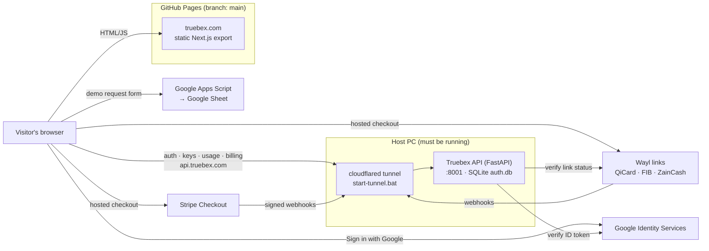

# Truebex

Website, account portal and developer API for **Truebex — True Building
Experience**, live at **https://truebex.com**.

Truebex itself is a desktop building design platform: measured daylight,
self-arranging surfaces, assets that update everywhere. This repo is everything
around it on the web:

- **Marketing site:** a static Next.js export on GitHub Pages.
- **Dashboard:** sign in with Google or email, manage API keys, see usage, and handle billing.
- **API server** (`server/`, FastAPI): accounts, API keys, usage metering, and billing through Stripe and Wayl, served at `api.truebex.com` through a Cloudflare tunnel.
- **Demo-request form:** writes to a Google Sheet via Apps Script.

> **Two repos, one GitHub project.** This folder (`X:\Truebex`, branch
> `master`) is the **source**. The live site is the **build output**, which lives
> in a separate clone (`X:\Truebex_site_files\Truebex`, branch `main`). GitHub
> Pages serves `main`. Read [Deployment](#deployment) before you change anything.

---

## Contents

- [Architecture](#architecture)
- [Repository layout](#repository-layout)
- [Branches](#branches)
- [Local development](#local-development)
- [Environment variables](#environment-variables)
- [Deployment](#deployment)
- [API server](#api-server-server)
- [Google sign-in](#google-sign-in)
- [API keys and usage](#api-keys-and-usage)
- [Licences, releases and downloads](#licences-releases-and-downloads)
- [Billing: Stripe and Wayl](#billing-stripe-and-wayl)
- [Brand, content and SEO](#brand-content-and-seo)
- [Demo request form](#demo-request-form)
- [Known issues](#known-issues)

---

## Architecture



The site is fully static, so `NEXT_PUBLIC_*` URLs are **baked in at build
time**. Anything that switches on later (the Google client ID and the payment
providers) is read from the API at runtime through `/config` and
`/billing/plans`. Turning those on needs only `server/.env` and a server
restart, not a rebuild.

---

## Repository layout

```
src/
  app/
    page.tsx               Landing page (+ SoftwareApplication & FAQPage JSON-LD)
    layout.tsx             Global metadata, fonts, Organization JSON-LD
    login/ signup/         Auth pages (Google + email)
    dashboard/             Signed-in area: overview (download, licence, devices), billing/,
                           link/ (approve a sign-in from the app), keys/ + usage/ (Developer)
    download/ changelog/   Public Download and Changelog pages (from src/content/releases.json)
    developers/            Public API docs (indexable)
    account/               Redirect to /dashboard/ (old URL)
    sitemap.ts robots.ts manifest.ts icon.svg apple-icon.png favicon.ico
  components/
    brand/Logo.tsx         Lockup / LogoMark / Wordmark from the Figma masters
    sections/              Landing sections (Hero, CoreFeatures, Pricing, FAQ, …)
    dashboard/             Shell (auth guard, nav), UsageChart, UsageMeter
    releases/              DownloadPanel, ReleaseNotes
    auth/                  AuthForm, GoogleButton, ProfileMenu
  lib/
    constants.ts           ALL site copy: features, roadmap, pricing, FAQ, SITE
    api.ts                 fetch wrapper, session token, date helpers
    auth.ts                accounts + Google sign-in
    developer.ts           keys, usage, billing calls
    licence.ts             licence API calls (devices, link approval, release feed)
    catalogue.ts           plan names and limits from server/app/catalogue.json
    releaseNotes.ts        the release-notes Markdown subset, parsed to a React-rendered tree
  content/releases.json    the release feed as of the last `npm run sync:releases`
public/
  brand/                   SVG media kit (mark + wordmark, grey/white/dark)
  images/product/          In-app captures (generated)
  images/og-image.jpg      1200×630 social card (generated)
scripts/make_web_assets.py Regenerates brand assets from the Unreal project
scripts/sync-releases.mjs  `npm run sync:releases`: release feed → src/content/releases.json
server/
  app/
    main.py                App + routers
    routers/               auth, keys, usage, billing, v1 (developer API), licence, releases, admin, files
    billing/               service.py (plan state) · providers.py (Stripe, Wayl)
    licence/               devices, link codes, seats, signed entitlements (Ed25519 over RFC 8785 JSON)
    releases/              signed release manifests, feed, download links
    contract_http.py       contract header + shared error envelope · ratelimit.py · tasks.py · storage/
    models.py database.py  SQLAlchemy models + additive SQLite migrations
    catalogue.json plans.py Plan catalogue: tiers, entitlement matrix, request quotas, key limits
  scripts/                 make_signing_key.py · publish_release.py · make_licence_fixtures.py
  tests/                   pytest suite (+ mock_wayl.py; contracts/licence/ = contract fixtures)
.claude/skills/            truebex-brand-voice · truebex-seo · truebex-deploy
google-apps-script/        Code.gs for the demo-request sheet
deploy-to-server.bat       Build → copy into the deploy repo → commit → push
start-server.bat           API on 127.0.0.1:8001 (creates the venv on first run)
start-tunnel.bat           cloudflared: api.truebex.com → :8001
```

---

## Branches

| Branch | Local clone | Contains | Notes |
|---|---|---|---|
| `master` | `X:\Truebex` | **Source code** | Commit your work here. |
| `main` | `X:\Truebex_site_files\Truebex` | **Built site** + `.github/` | Default branch. Every push deploys to GitHub Pages. Never edit by hand. |
| `gh-pages` | — | An old build (May 2026) | **Stale, not served.** Safe to delete. |

---

## Local development

**Requirements:** Node.js 20+ and Python 3.12. Use 3.12 specifically, because the
pinned server dependencies don't install on 3.14.

```bash
npm install
cp .env.example .env.local          # fill in the values (see below)

# API (separate terminal): creates server/.venv on first run, serves :8000
server\run.bat
```

> **Don't use `npm run dev` on this machine.** Turbopack's dev server spawned
> hundreds of PostCSS workers and used up all RAM. Test with a production build
> instead:
>
> ```bash
> NEXT_PUBLIC_AUTH_URL=http://127.0.0.1:8000 npm run build
> cd out && py -3.12 -m http.server 3001
> ```
>
> Then run the API with `CORS_ORIGINS=http://localhost:3001`. Rebuild with
> production URLs before deploying.

Server tests: `server\.venv\Scripts\python.exe -m pytest -q` (run from `server/`).

---

## Environment variables

### Frontend: `.env.local` (template: [`.env.example`](.env.example))

| Variable | Purpose | Production value |
|---|---|---|
| `NEXT_PUBLIC_AUTH_URL` | API base URL | `https://api.truebex.com` |
| `NEXT_PUBLIC_SHEETS_URL` | Apps Script web app URL for the demo form | `https://script.google.com/macros/s/…/exec` |

These end up in the public JavaScript, so never put secrets in them.

### API: `server/.env` (template: [`server/.env.example`](server/.env.example))

| Variable | Purpose |
|---|---|
| `SECRET_KEY` | Signs session JWTs. Long random string. |
| `ACCESS_TOKEN_EXPIRE_MINUTES` | Session lifetime (default 1440 = 24 h) |
| `DATABASE_URL` | SQLite file (default `sqlite:///./auth.db`) |
| `CORS_ORIGINS` | Must include `https://truebex.com,https://www.truebex.com` |
| `SITE_URL`, `API_URL` | Public URLs used in checkout redirects and webhook URLs |
| `GOOGLE_CLIENT_ID` | OAuth Web client ID. Empty hides the Google button. |
| `STRIPE_SECRET_KEY`, `STRIPE_WEBHOOK_SECRET`, `STRIPE_PRICE_PRO` | All three enable Stripe |
| `WAYL_API_KEY`, `WAYL_WEBHOOK_SECRET` | Both enable Wayl |
| `WAYL_ENV`, `WAYL_PRICE_PRO_IQD` | `live`/`test`; IQD price per 30 days (default 130,000) |
| `LICENCE_SIGNING_KEY`, `LICENCE_KEY_ID` | The `lic-*` Ed25519 seed that signs entitlements (`scripts/make_signing_key.py --kind lic`). Empty = licensing off (503). |
| `RELEASE_PUBLIC_KEYS` | Public `rel-*` keys as `kid:key,…` (the seeds never live on the API host) |
| `SIGNING_KEYS_EXTRA`, `TRIAL_DAYS` | Old `lic-*` public keys during a rotation; trial length (14) |
| `STORAGE_BACKEND`, `STORAGE_DIR`, `STORAGE_URL_SECRET` | `local` files under `./storage`, served by signed `/files` URLs on `API_URL` |
| `BACKGROUND_TASKS` | `inline` (jobs run in the API process: link purge, 90-day device lapse) or `off` |

---

## Deployment

```
master (X:\Truebex) ──npm run build──▶ out/ ──copy──▶ main (X:\Truebex_site_files\Truebex) ──push──▶ GitHub Pages
```

1. Commit and push `master`.
2. Make sure `.env.local` holds the **production** URLs.
3. Run **`deploy-to-server.bat`**. It builds, backs up the deploy folder,
   replaces everything except `.git`/`.github` with `out/`, commits, and pushes `main`.
4. Watch the "Deploy static content to Pages" run under the repo's **Actions** tab.

The full checklist, including how to verify the live site, is in
[`.claude/skills/truebex-deploy/SKILL.md`](.claude/skills/truebex-deploy/SKILL.md).

**Gotchas**

- **Git "dubious ownership" in the deploy folder.** Run `git config --global --add safe.directory X:/Truebex_site_files/Truebex` once. This is already done on this PC.
- **Custom domain.** Set in the repo's *Settings → Pages* (`main` has no `CNAME`).
- **Paths.** `next.config.ts` relies on `trailingSlash: true` and `assetPrefix: "/"` for nested routes on Pages.

---

## API server (`server/`)

FastAPI + SQLAlchemy + SQLite. Passwords use bcrypt, and sessions are JWTs kept
in `localStorage`. New columns are added on startup by
`database._ADDED_COLUMNS`. These migrations are additive only, so back up
`auth.db` first. Interactive API docs are served at `https://api.truebex.com/docs`.

| Method | Path | Auth | Purpose |
|---|---|---|---|
| GET | `/health` | — | Liveness → `{"status":"ok"}` |
| GET | `/config` | — | Public feature flags (Google client ID) |
| POST | `/auth/register` · `/auth/login` | — | Email/password → session token |
| POST | `/auth/google` | — | Google ID token → session token (signs up, signs in, or links) |
| GET | `/auth/me` | session | Current user |
| GET / POST / DELETE | `/keys`, `/keys/{id}` | session | List, create (key shown once), revoke |
| GET | `/usage` | session | This month: total, limit, daily, by endpoint, by key |
| GET | `/billing/plans` | — | Plans and enabled payment providers |
| GET | `/billing/subscription` · `/billing/payments` | session | Current plan, history |
| POST | `/billing/checkout` | session | `{plan, provider}` → hosted checkout URL |
| POST | `/billing/payments/{ref}/refresh` | session | Re-check a payment with its provider |
| POST | `/billing/portal` | session | Stripe customer portal URL |
| POST | `/billing/webhooks/stripe` · `/wayl` | provider | Payment events |
| GET | `/v1/ping` · `/v1/account` | **API key** | Developer API (metered) |
| POST | `/licence/link` · `/licence/link/poll` | — / poll secret | The app starts a browser sign-in and polls for its session |
| POST | `/licence/link/approve` · GET `/licence/link/{code}` | session | The website shows the device and approves or denies |
| POST | `/licence/activate` | session | Register a device → device token + signed entitlement |
| POST | `/licence/entitlement` · `/licence/trial` · `/licence/deactivate` | **device** | Fresh entitlement · the 14-day Pro trial · sign out |
| GET | `/licence/account` | **device** | The app's Account panel |
| GET / DELETE | `/licence/devices`, `/licence/devices/{id}` | session or device | List and remove devices |
| GET | `/licence/keys` | — | Published public keys (`lic-*`, `rel-*`) |
| GET | `/releases/feed` · `/releases/{version}/download` | — | Signed release manifests · a 15-minute download link |
| GET / POST / PATCH | `/admin/releases`, `/admin/releases/{version}` | admin | Upload (≤ 90 MB, signed off-host), withdraw, new notes |
| GET / PUT | `/files/{key}` | signed URL | Local storage downloads and uploads (HMAC, expiring) |

### Running in production

The API runs **on the host PC**:

1. `start-server.bat` serves the API on `127.0.0.1:8001`.
2. `start-tunnel.bat` runs the cloudflared tunnel `win-tunnel`
   (`%USERPROFILE%\.cloudflared\config.yml`), which routes `api.truebex.com → localhost:8001`.

If either one stops, `https://api.truebex.com/health` returns **HTTP 530 /
Cloudflare error 1033**. Login and the dashboard then stop working, but the rest
of the site is unaffected. The dashboard shows a "can't reach the server"
message rather than logging people out.

---

## Google sign-in

- **Frontend:** `GoogleButton.tsx` loads Google Identity Services and asks the
  API's `/config` for the client ID. It renders nothing when none is set.
- **Backend:** `POST /auth/google` verifies the ID token's signature, audience,
  issuer and expiry with `google-auth`, and requires a verified email. Then:
  - a known Google account signs in;
  - an existing email/password account gets Google linked to it;
  - otherwise a password-less account is created.

**Configured (2026-10-07).** Google Cloud project `truebex`, Google Auth
Platform app "Truebex" (External, **In production**, basic scopes only, no
logo, so no verification is needed). Its Web client "Truebex Website" allows the
JavaScript origins `https://truebex.com`, `https://www.truebex.com`,
`http://localhost:3001` and `http://localhost:3000`. The client ID is in
`server/.env` as `GOOGLE_CLIENT_ID`. The consent screen links to
[`/privacy/`](https://truebex.com/privacy/) and [`/terms/`](https://truebex.com/terms/),
so keep those pages live. Adding a logo to the consent screen would trigger
Google's verification review.

---

## API keys and usage

- Keys look like `tbx_live_…`. Only a SHA-256 hash is stored, and the full key is shown once at creation.
- Clients send the key as `Authorization: Bearer <key>` or `X-API-Key: <key>`.
- Every `/v1` call is counted per key, per endpoint, per UTC day (`usage_daily`).
- The monthly quota per plan is in `server/app/catalogue.json` (read by `plans.py`; the site imports the same file). Over quota returns `429`.
- Responses carry `X-RateLimit-Limit` and `X-RateLimit-Remaining`.

| Plan | Requests / month | Active keys |
|---|---|---|
| Free (`free`) | 1,000 | 2 |
| Pro (`pro`) | 100,000 | 20 |
| Studio, Team (`studio`, `team`) | 100,000 (placeholder until GD7) | 20 |
| Enterprise | 5,000,000 (set by hand) | 200 |

Public docs: [`/developers/`](https://truebex.com/developers/).

---

## Licences, releases and downloads

The desktop app's licence API follows the contract `licence-api` v1.0.0, which
lives in the Unreal project (`Docs/roadmap/40/contracts/licence-api.md`; the app
side is authoritative). Every licence route echoes `X-Truebex-Contract:
licence-api/1.0` and answers errors as `{detail, code, status, request_id,
retry_after_s, data}`.

- **Sign-in.** The app asks for a link code (`/licence/link`), opens
  `/dashboard/link/?code=…`, and polls until the signed-in person presses
  Approve. Email + password sign-in from the app uses `/auth/login` unchanged.
- **Devices.** `/licence/activate` returns a `tbx_dev_…` device token (stored as
  SHA-256) and a signed entitlement. Two devices per seat for now; the same
  computer keeps its device. Tokens lapse after 90 days unused.
- **Entitlements.** Ed25519 over the RFC 8785 bytes of the document, kid
  `lic-*`; refresh after 24 h, honoured offline for 14 days (floating seats:
  30 min / 2 h). The plan comes from `licence/seats.py` `seat_source(user)`;
  features and limits from `catalogue.json` (the contract's placeholder matrix
  until GD7).
- **Trial.** One 14-day Pro trial per account and per computer, stored as a
  `subscriptions` row with `provider="trial"`.
- **Releases.** Publish on the host:

  ```powershell
  cd server
  .venv\Scripts\python.exe scripts\make_signing_key.py --kind rel --out D:\keys\rel-2026-10.json   # once; keep it off the API host
  .venv\Scripts\python.exe scripts\publish_release.py --version 1.1.0 --channel stable --platform win64 `
      --file D:\builds\Truebex-Setup-1.1.0.exe --notes notes.md --key-file D:\keys\rel-2026-10.json
  cd ..; npm run sync:releases   # then build and deploy the site
  ```

  The feed (`/releases/feed`) serves the manifests exactly as signed; downloads
  get a 15-minute signed URL and need no account. Check any envelope or
  manifest with `python -m app.licence.signing verify <file> [--keys <url>]`.

---

## Billing: Stripe and Wayl

Both providers are built in. Each turns on as soon as its keys are in
`server/.env`, and stays hidden until then.

**The rule:** a plan only changes from an event the server verified itself. The
browser can never grant a plan.

**Stripe** (international cards, recurring):
- Uses Checkout in `mode=subscription`.
- Signed webhooks (`checkout.session.completed`,
  `customer.subscription.created/updated/deleted`) keep a `subscriptions` row in sync.
- The customer portal handles card changes and cancellation.

To set it up:
1. Create a recurring monthly Price.
2. Add a webhook endpoint at `https://api.truebex.com/billing/webhooks/stripe` for those events.
3. Set `STRIPE_SECRET_KEY`, `STRIPE_WEBHOOK_SECRET` and `STRIPE_PRICE_PRO`.

**Wayl** (Iraq: QiCard, FIB, ZainCash, IQD only):
- Wayl has payment links, not subscriptions, so each paid link buys a **30-day
  period**. Paying again stacks a further 30 days.
- Wayl doesn't document a webhook signature. The server therefore treats a
  webhook only as a hint, then fetches the link's real status from Wayl's API
  using the merchant key. It also re-checks when the customer returns to
  `/dashboard/billing/`, which covers webhooks missed while the PC was off.

To set it up:
1. Get a merchant key from the Wayl dashboard or `jisr@wayl.io`.
2. Set `WAYL_API_KEY`.
3. Set `WAYL_WEBHOOK_SECRET` to any random string of 10–255 characters.
4. Optionally set `WAYL_PRICE_PRO_IQD`.

`server/tests/mock_wayl.py` is a local stand-in for Wayl's API, for clicking
through the whole checkout without real money.

---

## Brand, content and SEO

- **Brand source of truth:** the Unreal project.
  - Logo masters: `T:\unreal5_7_4_projects\truebex_compact\Brand\Truebex\logo\figma_original`.
  - Colors: `MwBrand.cpp` (`#232323` / `#CBCBCB`) and `MwTheme.cpp` (accent `#A0CEFF`).
  - Font: Segoe UI, with an Open Sans fallback on the web, since Segoe UI isn't licensed for web hosting.
- **Regenerating assets:** `py -3.12 scripts/make_web_assets.py` rebuilds the
  icons, OG card, SVG media kit and product captures.
- **Site copy:** all of it lives in `src/lib/constants.ts`. Only shipped features go in
  `FEATURES`; planned ones go in `ROADMAP`. Public copy never names the
  engine or other software, and leads with distinctive features only (see
  `truebex-brand-voice`).
- **Product image:** the site shows a single clean capture (daylight through
  a doorway). Add more only if they have no HUD or labels.
- **Project skills** (Claude Code picks these up automatically in this repo):
  - `truebex-brand-voice`: voice, claims rules, visual tokens.
  - `truebex-seo`: per-page checklist, keyword map, indexing and distribution playbook.
  - `truebex-deploy`: ship and verify.

---

## Demo request form

The "Request a Demo" form posts to a Google Apps Script web app that appends to
a Google Sheet. See [`google-apps-script/README.md`](google-apps-script/README.md).

---

## Known issues

| Issue | Impact | Where |
|---|---|---|
| API depends on the host PC + tunnel being up | Sign-in, dashboard and billing stop when the PC is off | `start-server.bat`, `start-tunnel.bat` |
| Payment providers need merchant keys | Billing shows "being set up" until keys are added | `server/.env` |
| Desktop app doesn't read the plan yet | The licence API is live, but the app's sign-in and gates (LC1, LC3) are not shipped | Unreal project |
| Installers are served from this PC | Downloads go through the home tunnel until PF14 adds object storage and a CDN | `server/storage/` |
| `npm run dev` exhausts RAM on this PC | Use build + static server for local checks | — |
| The demo form can't detect failures (`no-cors`) | It always shows "Request received!" | `CTAContact.tsx` |
| Stale `gh-pages` branch | Confusing; not served | — |
