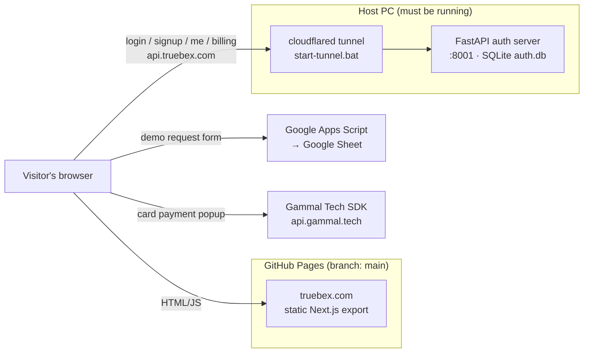

# Truebex

Marketing site and account portal for **Truebex — True Building Experience**,
live at **https://truebex.com**.

It is a static Next.js export hosted on GitHub Pages, backed by three external
services: a small FastAPI auth server, a Google Apps Script that stores demo
requests in a Google Sheet, and the Gammal Tech payment SDK.

> **Two repos, one GitHub project.** This folder (`X:\Truebex`, branch
> `master`) is the **source**. The live site is the **build output**, which lives
> in a separate clone (`X:\Truebex_site_files\Truebex`, branch `main`). GitHub
> Pages serves `main`. Read [Deployment](#deployment) before you change anything.

---

## Contents

- [Architecture](#architecture)
- [Repository layout](#repository-layout)
- [Branches](#branches)
- [Local development](#local-development)
- [Environment variables](#environment-variables)
- [Deployment](#deployment)
- [Auth API (server/)](#auth-api-server)
- [Demo request form](#demo-request-form)
- [Payments (Gammal Tech)](#payments-gammal-tech)
- [Known issues](#known-issues)

---

## Architecture



The site is fully static, so every backend URL is **baked into the JavaScript
at build time** from `.env.local`. Changing a URL means rebuilding and
redeploying.

| Piece | Where it lives | What it does |
|---|---|---|
| Frontend | `src/` → GitHub Pages | Landing page, `/login`, `/signup`, `/account`, `/payments/callback` |
| Auth API | `server/` → `api.truebex.com` | Email/password accounts, JWT, plan activation |
| Demo form backend | `google-apps-script/` → Google | Appends demo requests to a Google Sheet |
| Payments | Gammal Tech Web SDK | Card checkout in a popup; card data never touches our servers |

---

## Repository layout

```
src/
  app/                    Next.js App Router pages
    page.tsx              Landing page (all marketing sections)
    login/ signup/        Auth pages (use components/auth/AuthForm)
    account/              Signed-in dashboard
    payments/callback/    Gammal Tech payment landing / verification page
  components/
    sections/             Landing page sections (Hero, Pricing, CTAContact, …)
    layout/ ui/ auth/     Navbar, Footer, Button, GlassCard, ProfileMenu, …
  lib/
    constants.ts          Nav links, features, pricing plans — most copy lives here
    auth.ts, useAuth.ts   Client for the FastAPI auth server (token in localStorage)
    gammalPay.ts          Wrapper around the Gammal Tech SDK
public/                   Static files copied as-is (background image, .nojekyll, …)
server/                   FastAPI auth server (Python)
google-apps-script/       Code.gs for the demo-request Google Sheet + setup guide
deploy-to-server.bat      Build → copy into the deploy repo → commit → push (THE deploy)
build-to-directory.*      Build and copy into the deploy repo only (no git)
start-server.bat          Start the auth API on :8001
start-tunnel.bat          Start the cloudflared tunnel (api.truebex.com → :8001)
run_dev_server.bat        npm run dev
```

---

## Branches

All of these are branches of `github.com/dr99tm/Truebex`:

| Branch | Local clone | Contains | Notes |
|---|---|---|---|
| `master` | `X:\Truebex` | **Source code** | Commit your work here. |
| `main` | `X:\Truebex_site_files\Truebex` | **Built site only** + `.github/workflows/static.yml` | Default branch. Every push deploys to GitHub Pages. Never edit by hand. |
| `gh-pages` | — | An old build (May 2026) | **Stale, not served.** Left over from an earlier deploy method. Safe to delete. |

`master` and `main` have unrelated histories, which is expected. `main` is
generated output.

---

## Local development

**Requirements:** Node.js 20+, and Python 3.12 or 3.13 for the auth API (the
pinned dependencies may not install on newer Python versions).

```bash
npm install
cp .env.example .env.local      # then fill in the values (see below)
npm run dev                     # http://localhost:3000
```

The landing page and demo form work with only the frontend running. To use
login, signup, or the dashboard locally, also run the auth API and point
`NEXT_PUBLIC_AUTH_URL` at it:

```bash
cd server
cp .env.example .env            # set SECRET_KEY
server\run.bat                  # creates .venv on first run; serves on :8000
```

> `server/run.bat` uses port **8000** (local dev). `start-server.bat` uses
> port **8001**, which is the port the production tunnel forwards to.

Other commands: `npm run build` (static export into `out/`), `npm run lint`.

---

## Environment variables

### Frontend: `.env.local` (template: [`.env.example`](.env.example))

| Variable | Purpose | Production value |
|---|---|---|
| `NEXT_PUBLIC_AUTH_URL` | Auth API base URL | `https://api.truebex.com` |
| `NEXT_PUBLIC_SHEETS_URL` | Apps Script web app URL for the demo form | `https://script.google.com/macros/s/…/exec` |
| `NEXT_PUBLIC_GAMMAL_SDK_URL` | Gammal Tech Web SDK script | `https://api.gammal.tech/sdk-web.js` |

These end up **inside the public JavaScript bundle**, so never put secrets in
`NEXT_PUBLIC_*` variables. Rebuild after any change.

### Auth API: `server/.env` (template: [`server/.env.example`](server/.env.example))

| Variable | Purpose |
|---|---|
| `SECRET_KEY` | Signs JWTs. **Must** be a long random string in production: `python -c "import secrets; print(secrets.token_urlsafe(48))"` |
| `ACCESS_TOKEN_EXPIRE_MINUTES` | Token lifetime (default 1440 = 24 h) |
| `DATABASE_URL` | SQLite file (default `sqlite:///./auth.db`) |
| `CORS_ORIGINS` | Allowed browser origins. Must include `https://truebex.com` and `https://www.truebex.com` |

---

## Deployment

The site is deployed by building `master` and pushing the output to `main`.
GitHub Actions (`static.yml` on `main`) then publishes it to Pages.

```
master (X:\Truebex) ──npm run build──▶ out/ ──copy──▶ main (X:\Truebex_site_files\Truebex) ──push──▶ GitHub Pages
```

### Steps

1. Commit and push your source changes on `master`.
2. Make sure `.env.local` holds the **production** URLs (see above).
3. Run **`deploy-to-server.bat`**. It will:
   - run `npm run build`
   - back up the deploy folder to `X:\Truebex_site_files\Truebex_backup_<timestamp>`
   - delete everything in the deploy folder except `.git` and `.github`
   - copy `out/` in, then commit and push `main`
4. Watch the "Deploy static content to Pages" run under the repo's **Actions**
   tab. When it goes green, the site is live within a minute or two.

### Doing it by hand

```bash
npm run build
# in X:\Truebex_site_files\Truebex: delete everything except .git and .github, then
cp -a /x/Truebex/out/. .
git add -A && git commit -m "Deploy: build master <sha>" && git push origin main
```

### Gotchas

- **Git "dubious ownership" error** in the deploy folder: the X: drive's files
  belong to another Windows account. Fix it once with
  `git config --global --add safe.directory X:/Truebex_site_files/Truebex`.
- **Custom domain:** `main` has no `CNAME` file, because the deploy script
  deletes everything. The domain `truebex.com` is set in the repo's
  *Settings → Pages* instead. If the domain ever drops, set it there again.
- **Paths:** `next.config.ts` uses `trailingSlash: true` and `assetPrefix: "/"`
  so nested routes like `/login/` load their JS correctly on Pages. Don't
  change these without testing a nested route.
- **Backups pile up:** each deploy leaves a full `Truebex_backup_*` folder.
  Delete old ones from time to time; git history on `main` already holds every
  deploy.

---

## Auth API (`server/`)

FastAPI + SQLAlchemy + SQLite. Passwords are hashed with bcrypt; sessions are
JWT bearer tokens that the frontend keeps in `localStorage`.

| Method | Path | Auth | Purpose |
|---|---|---|---|
| GET | `/health` | — | Liveness check → `{"status":"ok"}` |
| POST | `/auth/register` | — | Create an account, returns a token and the user |
| POST | `/auth/login` | — | Returns a token and the user |
| GET | `/auth/me` | Bearer | The current user |
| POST | `/billing/activate` | Bearer | Mark the user's plan as paid (see [Known issues](#known-issues)) |

### How production runs

The API runs **on the host PC**, not in the cloud:

1. `start-server.bat` serves the API on port `8001` (it creates `server/.venv` on first run).
2. `start-tunnel.bat` runs the named cloudflared tunnel `win-tunnel`, configured
   in `C:\Users\Tariq\.cloudflared\config.yml`, which routes
   `api.truebex.com → http://localhost:8001`.

If either one isn't running, `https://api.truebex.com/health` returns
**Cloudflare error 1033 / HTTP 530**, and login, signup, and the dashboard
stop working on the live site. The rest of the site is unaffected.

If `server/.venv` breaks (for example after the Python it was created with is
uninstalled), delete the folder and run `start-server.bat` again.

---

## Demo request form

The "Request a Demo" form (`src/components/sections/CTAContact.tsx`) posts to
a Google Apps Script web app, which appends a row to a Google Sheet. Setup,
redeploy steps, and caveats are in
[`google-apps-script/README.md`](google-apps-script/README.md).

Quick health check: open the `NEXT_PUBLIC_SHEETS_URL` in a browser. It should
return `{"result":"ok"}`.

---

## Payments (Gammal Tech)

The Professional plan ($99/mo) is paid through the Gammal Tech Web SDK
(`src/lib/gammalPay.ts`). Clicking the plan's button in **Pricing** loads the
SDK, opens Gammal's card popup, and on success calls `confirmDelivery`.
`/payments/callback` handles the redirect fallback (for example 3-D Secure when
popups are blocked) by verifying the `payment_id` in the URL.

Before payments work in production, Gammal Tech must **pre-approve the
account** and **whitelist the callback page** (`https://truebex.com/payments/callback/`).
Contact dev@gammal.tech.

`public/gammal-tech.html` is a static page about Gammal Tech, served at
`/gammal-tech.html`.

---

## Known issues

| Issue | Impact | Where |
|---|---|---|
| Auth API depends on the host PC + tunnel being up | Login, signup, and the dashboard break when the PC is off | `start-server.bat`, `start-tunnel.bat` |
| A paid plan is never recorded: `activatePlan()` is never called after payment | Users stay on the "free" plan after paying | `src/lib/auth.ts`, `Pricing.tsx`, `payments/callback/page.tsx` |
| `/billing/activate` trusts any `payment_id` without checking it with Gammal | Once wired up, any logged-in user could grant themselves Pro | `server/app/main.py` |
| Dashboard "Upgrade to Pro" links to `/payments/callback` instead of pricing | The link lands on "No payment to show" | `src/app/account/page.tsx` |
| `og-image.jpg` is referenced but missing | Social link previews have no image | `src/app/layout.tsx`, `public/images/` |
| The demo form can't detect failures (`no-cors`) | It always shows "Request received!" | `CTAContact.tsx` |
| Stale `gh-pages` branch | Confusing; not served | — |
