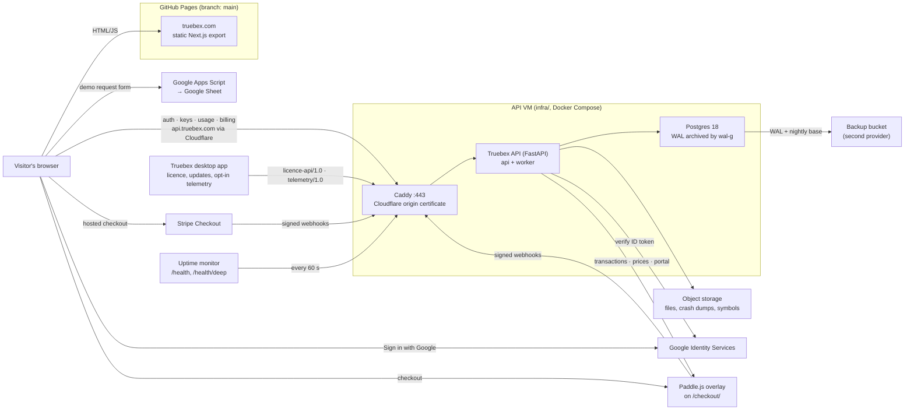

# Truebex

Website, account portal and developer API for **Truebex — True Building
Experience**, live at **https://truebex.com**.

Truebex itself is a desktop building design platform: measured daylight,
self-arranging surfaces, assets that update everywhere. This repo is everything
around it on the web:

- **Marketing site:** a static Next.js export on GitHub Pages.
- **Dashboard:** sign in with Google or email, manage API keys, see usage, and handle billing.
- **API server** (`server/`, FastAPI): accounts, API keys, usage metering, billing through the UK company (Paddle as reseller by default, Stripe with Stripe Tax as the alternative), licences, devices and the release feed for the desktop app, and its opt-in telemetry, crash reports and feedback, served at `api.truebex.com` from a Linux VM (Docker Compose behind Cloudflare, built from [`infra/`](infra/README.md)).
- **Demo-request form:** writes to a Google Sheet via Apps Script.

> **Two repos, one GitHub project.** This folder (`X:\Truebex`, branch
> `master`) is the **source**. The live site is the **build output**, which lives
> in a separate clone (`X:\Truebex_site_files\Truebex`, branch `main`). GitHub
> Pages serves `main`. Read [Deployment](#deployment) before you change anything.

---

## Contents

- [Architecture](#architecture)
- [Repository layout](#repository-layout)
- [Branches](#branches)
- [Local development](#local-development)
- [Environment variables](#environment-variables)
- [Deployment](#deployment)
- [API server](#api-server-server)
- [Google sign-in](#google-sign-in)
- [API keys and usage](#api-keys-and-usage)
- [Licences, releases and downloads](#licences-releases-and-downloads)
- [Organisations, seats and SSO](#organisations-seats-and-sso)
- [Billing: Paddle and Stripe](#billing-paddle-and-stripe)
- [Brand, content and SEO](#brand-content-and-seo)
- [Demo request form](#demo-request-form)
- [Known issues](#known-issues)

---

## Architecture



The site is fully static, so `NEXT_PUBLIC_*` URLs are **baked in at build
time**. Anything that switches on later (the Google client ID and the payment
providers) is read from the API at runtime through `/config` and
`/billing/plans`. Turning those on needs only `server/.env` and a server
restart, not a rebuild.

---

## Repository layout

```
src/
  app/
    page.tsx               Landing page (+ SoftwareApplication & FAQPage JSON-LD)
    layout.tsx             Global metadata, fonts, Organization JSON-LD, verification tags
    pricing/               Plans from server/app/catalogue.json (+ comparison, FAQ)
    features/[slug]/       One page per search cluster (FEATURE_PAGES)
    roadmap/ changelog/    Roadmap (src/content/roadmap.json); changelog (milestones + releases, version anchors) + feed.xml
    ar/                    Arabic landing page (RTL; lang/dir set by scripts/postbuild-lang.mjs)
    login/ signup/         Auth pages (Google + email)
    dashboard/             Signed-in area: overview (download, licence, devices), billing/,
                           link/ (approve a sign-in from the app), keys/ + usage/ (Developer),
                           admin/growth/ + admin/telemetry/
    download/              Public Download page (from src/content/releases.json)
    developers/            Public API docs (indexable)
    account/               Redirect to /dashboard/ (old URL)
    sitemap.ts robots.ts manifest.ts icon.svg apple-icon.png favicon.ico
  components/
    brand/Logo.tsx         Lockup / LogoMark / Wordmark from the Figma masters
    sections/              Landing sections (Hero, CoreFeatures, Pricing, FAQ, …)
    dashboard/             Shell (auth guard, nav), UsageChart, UsageMeter
    releases/              DownloadPanel, ReleaseNotes
    auth/                  AuthForm, GoogleButton, ProfileMenu
  lib/
    constants.ts           ALL site copy: features, pricing, feature pages, Arabic, FAQ, SITE
    catalogue.ts           Plan catalogue types, price formatting, JSON-LD offers
    api.ts                 fetch wrapper, session token, date helpers
    auth.ts                accounts + Google sign-in
    developer.ts           keys, usage, billing calls
    licence.ts             licence API calls (devices, link approval, release feed)
    plans.ts               plan names and limits from server/app/catalogue.json
    releaseNotes.ts        the release-notes Markdown subset, parsed to a React-rendered tree
    telemetryAdmin.ts      admin telemetry dashboard calls
  content/                 roadmap.json, history.json; releases.json + releases-beta.json (the release
                           feed as of the last `npm run sync:releases`)
public/
  brand/                   SVG media kit (mark + wordmark, grey/white/dark)
  images/product/          In-app captures (generated)
  images/og-image.jpg      1200×630 social card (generated)
scripts/make_web_assets.py Regenerates brand assets from the Unreal project
scripts/sync-releases.mjs  `npm run sync:releases`: release feed → src/content/releases.json (+ releases-beta.json)
scripts/postbuild-lang.mjs <html lang="ar" dir="rtl"> for out/ar/ (part of npm run build)
scripts/sync-roadmap.mjs   Roadmap statuses from the two trackers (owner, before a deploy)
scripts/indexnow.mjs       Ping IndexNow with changed URLs (owner, after a deploy)
server/
  app/
    main.py                App + routers
    routers/               auth, keys, usage, billing, v1 (developer API), licence, releases, admin, files,
                           growth, telemetry, admin_telemetry
    billing/               service.py (plan state) · base.py (BillingProvider) · paddle_, stripe_, wayl_provider.py · jobs.py
    licence/               devices, link codes, seats, signed entitlements (Ed25519 over RFC 8785 JSON)
    releases/              signed release manifests, feed, download links
    telemetry/             contracts/telemetry.md: service, privacy scanner, symbolication, jobs
    storage/ mail/         blob storage (local, s3) · mail (console, smtp) with templates
    tasks.py worker.py     periodic jobs (@periodic), inline or in the worker process
    ratelimit.py contract_http.py health.py ops.py   shared plumbing (PF14): limits, contract header and
                           error envelope, /health/deep, backup checks and alerts
    models.py database.py  SQLAlchemy models + additive migrations (SQLite and Postgres)
    catalogue.json         Tiers, entitlement matrix, prices per interval and currency, founding offer (read by the site at build time)
    plans.py               Reads catalogue.json: prices, entitlement matrix, request quotas, key limits
    growth/                Admin growth counts (sign-ups, downloads, trials, checkouts)
  scripts/                 sync_prices.py (catalogue prices → Paddle or Stripe) · make_signing_key.py · publish_release.py ·
                           make_licence_fixtures.py · sqlite_to_postgres.py · upload_symbols.py · make_admin.py
  tests/                   pytest suite (+ mock_paddle.py, mock_wayl.py for click-through tests; contracts/licence/ and
                           contracts/telemetry/ = contract fixtures)
  Dockerfile               the API image (api and worker services)
infra/                     the API host: OpenTofu, cloud-init, Compose, Caddy, backups,
                           monitoring, deploy.ps1, restore-test.ps1, CUTOVER.md
.claude/skills/            truebex-brand-voice · truebex-seo · truebex-deploy
google-apps-script/        Code.gs for the demo-request sheet
deploy-to-server.bat       Build → copy into the deploy repo → commit → push
start-server.bat           Local use only: API on 127.0.0.1:8001 (production is the VM)
start-tunnel.bat           Local use only: cloudflared (no longer serves api.truebex.com)
```

---

## Branches

| Branch | Local clone | Contains | Notes |
|---|---|---|---|
| `master` | `X:\Truebex` | **Source code** | Commit your work here. |
| `main` | `X:\Truebex_site_files\Truebex` | **Built site** + `.github/` | Default branch. Every push deploys to GitHub Pages. Never edit by hand. |
| `gh-pages` | — | An old build (May 2026) | **Stale, not served.** Safe to delete. |

---

## Local development

**Requirements:** Node.js 20+ and Python 3.12. Use 3.12 specifically, because the
pinned server dependencies don't install on 3.14.

```bash
npm install
cp .env.example .env.local          # fill in the values (see below)

# API (separate terminal): creates server/.venv on first run, serves :8000
server\run.bat
```

> **Don't use `npm run dev` on this machine.** Turbopack's dev server spawned
> hundreds of PostCSS workers and used up all RAM. Test with a production build
> instead:
>
> ```bash
> NEXT_PUBLIC_AUTH_URL=http://127.0.0.1:8000 npm run build
> cd out && py -3.12 -m http.server 3001
> ```
>
> Then run the API with `CORS_ORIGINS=http://localhost:3001`. Rebuild with
> production URLs before deploying.

Server tests: `server\.venv\Scripts\python.exe -m pytest -q` (run from `server/`).

---

## Environment variables

### Frontend: `.env.local` (template: [`.env.example`](.env.example))

| Variable | Purpose | Production value |
|---|---|---|
| `NEXT_PUBLIC_AUTH_URL` | API base URL | `https://api.truebex.com` |
| `NEXT_PUBLIC_SHEETS_URL` | Apps Script web app URL for the demo form | `https://script.google.com/macros/s/…/exec` |

These end up in the public JavaScript, so never put secrets in them.

### API: `server/.env` (template: [`server/.env.example`](server/.env.example))

| Variable | Purpose |
|---|---|
| `SECRET_KEY` | Signs session JWTs. Long random string. |
| `ACCESS_TOKEN_EXPIRE_MINUTES` | Session lifetime (default 1440 = 24 h) |
| `DATABASE_URL` | SQLite locally (default `sqlite:///./auth.db`); `postgresql+psycopg://…` on the VM |
| `CORS_ORIGINS` | Must include `https://truebex.com,https://www.truebex.com` |
| `SITE_URL`, `API_URL` | Public URLs used in checkout redirects and webhook URLs |
| `GOOGLE_CLIENT_ID` | OAuth Web client ID. Empty hides the Google button. |
| `BILLING_PROVIDER` | `paddle` (default) or `stripe`: the provider checkout uses |
| `PADDLE_ENV`, `PADDLE_API_KEY`, `PADDLE_WEBHOOK_SECRET`, `PADDLE_CLIENT_TOKEN` | `sandbox`/`production`; key and webhook secret enable Paddle; the client token (public) is served by `/config` for Paddle.js |
| `PADDLE_API_BASE` | Optional override of Paddle's API host (the local mock) |
| `STRIPE_SECRET_KEY`, `STRIPE_WEBHOOK_SECRET` | Both enable Stripe |
| `STRIPE_PRICE_PRO` | The original monthly Pro price: existing subscribers keep Pro |
| `STRIPE_TAX_ENABLED` | `true` turns on Stripe Tax (`automatic_tax`) |
| `WAYL_ENABLED`, `WAYL_API_KEY`, `WAYL_WEBHOOK_SECRET`, `WAYL_ENV`, `WAYL_PRICE_PRO_IQD` | Dormant rail: off unless `WAYL_ENABLED=true`; never offered on the site |
| `LICENCE_SIGNING_KEY`, `LICENCE_KEY_ID` | The `lic-*` Ed25519 seed that signs entitlements (`scripts/make_signing_key.py --kind lic`). Empty = licensing off (503). |
| `RELEASE_PUBLIC_KEYS` | Public `rel-*` keys as `kid:key,…` (the seeds never live on the API host) |
| `SIGNING_KEYS_EXTRA`, `TRIAL_DAYS` | Old `lic-*` public keys during a rotation; trial length (14) |
| `STORAGE_BACKEND`, `STORAGE_DIR`, `STORAGE_URL_SECRET` | `local` files under `./storage`, served by signed `/files` URLs on `API_URL`, or `s3` |
| `S3_*`, `CDN_BASE_URL` | The S3-compatible bucket (`STORAGE_BACKEND=s3`) and the CDN for its public prefixes |
| `MAIL_BACKEND`, `MAIL_FROM`, `SUPPORT_EMAIL`, `SMTP_*` | Mail: `console` locally, `smtp` on the VM |
| `BACKGROUND_TASKS` | `inline` (default), `worker` (the VM's worker process) or `off` (tests): telemetry rollup and retention, symbolication, link purge, 90-day device lapse, founding holds, billing reconcile, backup checks, floating-seat lease and invite expiry, SSO request and audit purges |
| `RATELIMIT_BACKEND` | `memory` (one process) or `db` (the VM's two API processes) |
| `ALERT_EMAIL`, `ALERT_PUSH_URL`, `BACKUP_EXPECTED` | Alerts from the server's own backup check |
| `TELEMETRY_EVENTS_ENABLED`, `TELEMETRY_INGESTION_ENABLED` | The usage-events kill switch; telemetry as a whole (off → 503) |
| `SSO_SECRET_KEY` | Fernet key sealing organisations' SSO client secrets (empty derives one from `SECRET_KEY`) |
| `SAML_SP_ENTITY_ID`, `AUDIT_RETENTION_DAYS` | This service's SAML entity id (empty: each organisation's metadata URL); how long the audit log keeps events (730) |

On the VM these come from `infra/secrets/*.sops.env` (template: `infra/secrets/server.env.example`).

---

## Deployment

```
master (X:\Truebex) ──npm run build──▶ out/ ──copy──▶ main (X:\Truebex_site_files\Truebex) ──push──▶ GitHub Pages
```

1. Commit and push `master`.
2. Make sure `.env.local` holds the **production** URLs.
3. Run **`deploy-to-server.bat`**. It builds, backs up the deploy folder,
   replaces everything except `.git`/`.github` with `out/`, commits, and pushes `main`.
4. Watch the "Deploy static content to Pages" run under the repo's **Actions** tab.

The full checklist, including how to verify the live site, is in
[`.claude/skills/truebex-deploy/SKILL.md`](.claude/skills/truebex-deploy/SKILL.md).

**Gotchas**

- **Git "dubious ownership" in the deploy folder.** Run `git config --global --add safe.directory X:/Truebex_site_files/Truebex` once. This is already done on this PC.
- **Custom domain.** Set in the repo's *Settings → Pages* (`main` has no `CNAME`).
- **Paths.** `next.config.ts` relies on `trailingSlash: true` and `assetPrefix: "/"` for nested routes on Pages.

---

## API server (`server/`)

FastAPI + SQLAlchemy on Postgres in production and SQLite locally; every model
and query runs on both (`database.dialect_insert` is the one place a dialect is
named). Passwords use bcrypt, and sessions are JWTs kept in `localStorage`. New
columns are added on startup by `database._ADDED_COLUMNS`; these migrations are
additive only. Interactive API docs are served at `https://api.truebex.com/docs`.
Contract endpoints (`/telemetry/*`) answer errors in the shared envelope
`{detail, code, status, request_id, retry_after_s, data}`.

| Method | Path | Auth | Purpose |
|---|---|---|---|
| GET | `/health` | — | Liveness → `{"status":"ok"}` |
| GET | `/health/deep` | — (rate-limited) | Database, storage round trip, worker heartbeat → 200 or 503 |
| GET | `/config` | — | Public feature flags (Google client ID) |
| POST | `/auth/register` · `/auth/login` | — | Email/password → session token |
| POST | `/auth/google` | — | Google ID token → session token (signs up, signs in, or links) |
| GET | `/auth/me` | session | Current user |
| GET / POST / DELETE | `/keys`, `/keys/{id}` | session | List, create (key shown once), revoke |
| GET | `/usage` | session | This month: total, limit, daily, by endpoint, by key |
| GET | `/billing/plans` | — | Tiers, prices per interval and currency, founding offer, checkout provider |
| GET | `/billing/subscription` · `/billing/payments` | session | Tier, interval, seats, renewal; payment history |
| POST | `/billing/checkout` | session | `{tier, interval, currency, seats, coupon?, consent}` → checkout URL |
| POST | `/billing/payments/{ref}/refresh` | session | Re-check a payment with its provider |
| POST | `/billing/seats` · `/billing/change` | session | Seats, or tier / interval, prorated |
| GET | `/billing/invoices` | session | Invoices with PDF links |
| POST | `/billing/portal` | session | The provider's customer portal |
| POST | `/billing/webhooks/paddle` · `/stripe` · `/wayl` | provider | Payment events (`/wayl` only with `WAYL_ENABLED`) |
| GET | `/v1/ping` · `/v1/account` | **API key** | Developer API (metered) |
| POST | `/licence/link` · `/licence/link/poll` | — / poll secret | The app starts a browser sign-in and polls for its session |
| POST | `/licence/link/approve` · GET `/licence/link/{code}` | session | The website shows the device and approves or denies |
| POST | `/licence/activate` | session | Register a device → device token + signed entitlement |
| POST | `/licence/entitlement` · `/licence/trial` · `/licence/deactivate` | **device** | Fresh entitlement · the 14-day Pro trial · sign out |
| GET | `/licence/account` | **device** | The app's Account panel |
| GET / DELETE | `/licence/devices`, `/licence/devices/{id}` | session or device | List and remove devices |
| GET | `/licence/keys` | — | Published public keys (`lic-*`, `rel-*`) |
| GET | `/releases/feed` · `/releases/{version}/download` | — | Signed release manifests · a 15-minute download link |
| GET / POST / PATCH | `/admin/releases`, `/admin/releases/{version}` | admin | Upload (≤ 90 MB, signed off-host), withdraw, new notes |
| GET | `/admin/growth?from=&to=` | session, admin | Sign-ups, downloads, trials, checkouts, paid per UTC day (counts only) |
| GET | `/telemetry/config` | — | Event allow-list, sampling, kill switch (`X-Truebex-Contract: telemetry/1.0`) |
| POST | `/telemetry/events` · `/crashes` · `/feedback` · `/delete` | — (device token for a feedback reply; install secret for delete) | Opt-in usage events, crash reports, feedback, deletion |
| GET / PATCH / POST | `/admin/telemetry/*` · `/admin/feedback/*` · `/admin/symbols` | **admin** | Telemetry dashboard, crash groups, feedback inbox and replies, symbols |
| GET / PUT | `/files/{key}?exp=&sig=` | signed URL | Local storage downloads and uploads (HMAC, expiring) |
| POST | `/licence/release` | **device** | Hand a floating seat back at exit (contract 5.11) |
| POST / GET | `/orgs` | session | Create an organisation (you become owner) · your organisations |
| GET / PATCH / DELETE | `/orgs/{id}` | member / admin / owner | Details · rename · delete (409 with a live subscription) |
| GET · PATCH / DELETE | `/orgs/{id}/members` · `/orgs/{id}/members/{user_id}` | member · admin (or self) | Members · change role, remove, leave (409 `last_owner`) |
| POST / GET / DELETE | `/orgs/{id}/invites`, `…/{invite_id}`, `…/{invite_id}/resend` | admin | Invite by e-mail (7-day link), list, revoke, resend |
| POST | `/invites/preview` · `/invites/accept` | — · session | What `/invite/` shows · accept with the invited address |
| GET · PUT | `/orgs/{id}/seats` · `/seats/settings` · `/seats/{user_id}` | admin | Seats and leases · how many float · give a named / floating seat |
| GET | `/orgs/{id}/usage?month=` · `/orgs/{id}/audit?kind=&cursor=&format=csv` | admin | Usage per member · the audit log (JSON or CSV) |
| GET / PUT / DELETE | `/orgs/{id}/sso` · POST `/orgs/{id}/sso/break-glass` | owner | OIDC or SAML connection (secrets write-only) · a new break-glass code |
| POST / GET / DELETE | `/orgs/{id}/domains`, `…/{domain}/verify` | owner | E-mail domains, verified by a DNS TXT record |
| GET | `/auth/sso/start?email=&next=` | — | 302 to the organisation's identity provider (`format=json` → `{url}`) |
| GET · POST | `/auth/sso/oidc/callback` · `/auth/sso/saml/{slug}/acs` | `state` · signed assertion | Finish SSO → `/login/sso/#token=…` |
| GET | `/auth/sso/saml/{slug}/metadata` | — | SP metadata XML |

### Running in production

The API runs on **one Linux VM** with Docker Compose: Caddy (443, Cloudflare
origin certificate, only Cloudflare's ranges allowed in), two uvicorn processes,
a worker for background jobs, and Postgres 18 whose WAL is archived continuously
(nightly base backups, 30 days, at a second provider; a weekly restore test).
Everything is rebuilt from [`infra/`](infra/README.md); the one-time move off the
home PC is [`infra/CUTOVER.md`](infra/CUTOVER.md) (RPO 5 minutes, RTO 2 hours).

- **Deploy:** `powershell -NoProfile -ExecutionPolicy Bypass -File infra\deploy.ps1 -VmHost truebex@<vm>`
  (committed HEAD, secrets decrypted with sops only for the copy, waits for `/health/deep`).
- **Health:** `https://api.truebex.com/health` (liveness) and `/health/deep`
  (`{"db":"ok","storage":"ok","worker_heartbeat_s":…}`, 503 when anything is down).
- **Alerts:** a hosted monitor checks both every 60 s from several regions and
  alerts by e-mail and phone push; the host checks disk, memory, load,
  containers, the 5xx rate and the certificate every minute; the worker alerts
  on stale backups. Details: [`infra/README.md`](infra/README.md#alerts).
- **Backups:** `infra\restore-test.ps1 -VmHost truebex@<vm>` → `restore OK`.
- **Admins:** `cd server; .venv\Scripts\python.exe -m scripts.make_admin <email>`
  (on the VM: `docker compose exec api python -m scripts.make_admin <email>`).

`start-server.bat` and `start-tunnel.bat` are for local use only. An API left
running on the PC with its own `auth.db` would accept writes nobody sees, so the
tunnel no longer routes `api.truebex.com`. While the site cannot reach the API
(Cloudflare 52x), the dashboard shows a "can't reach the server" message rather
than logging people out.

---

## Google sign-in

- **Frontend:** `GoogleButton.tsx` loads Google Identity Services and asks the
  API's `/config` for the client ID. It renders nothing when none is set.
- **Backend:** `POST /auth/google` verifies the ID token's signature, audience,
  issuer and expiry with `google-auth`, and requires a verified email. Then:
  - a known Google account signs in;
  - an existing email/password account gets Google linked to it;
  - otherwise a password-less account is created.

**Configured (2026-10-07).** Google Cloud project `truebex`, Google Auth
Platform app "Truebex" (External, **In production**, basic scopes only, no
logo, so no verification is needed). Its Web client "Truebex Website" allows the
JavaScript origins `https://truebex.com`, `https://www.truebex.com`,
`http://localhost:3001` and `http://localhost:3000`. The client ID is in
`server/.env` as `GOOGLE_CLIENT_ID`. The consent screen links to
[`/privacy/`](https://truebex.com/privacy/) and [`/terms/`](https://truebex.com/terms/),
so keep those pages live. Adding a logo to the consent screen would trigger
Google's verification review.

---

## API keys and usage

- Keys look like `tbx_live_…`. Only a SHA-256 hash is stored, and the full key is shown once at creation.
- Clients send the key as `Authorization: Bearer <key>` or `X-API-Key: <key>`.
- Every `/v1` call is counted per key, per endpoint, per UTC day (`usage_daily`).
- The monthly quota per plan is in `server/app/catalogue.json` (read by `plans.py`; the site imports the same file). Over quota returns `429`.
- Responses carry `X-RateLimit-Limit` and `X-RateLimit-Remaining`.

| Plan | Requests / month | Active keys |
|---|---|---|
| Free (`free`) | 1,000 | 2 |
| Pro (`pro`) | 100,000 | 20 |
| Studio, Team (`studio`, `team`) | 100,000 (placeholder until GD7) | 20 |
| Enterprise | 5,000,000 (set by hand) | 200 |

Public docs: [`/developers/`](https://truebex.com/developers/).

---

## Licences, releases and downloads

The desktop app's licence API follows the contract `licence-api` v1.0.0, which
lives in the Unreal project (`Docs/roadmap/40/contracts/licence-api.md`; the app
side is authoritative). Every licence route echoes `X-Truebex-Contract:
licence-api/1.0` and answers errors as `{detail, code, status, request_id,
retry_after_s, data}`.

- **Sign-in.** The app asks for a link code (`/licence/link`), opens
  `/dashboard/link/?code=…`, and polls until the signed-in person presses
  Approve. Email + password sign-in from the app uses `/auth/login` unchanged.
- **Devices.** `/licence/activate` returns a `tbx_dev_…` device token (stored as
  SHA-256) and a signed entitlement. Two devices per seat for now; the same
  computer keeps its device. Tokens lapse after 90 days unused.
- **Entitlements.** Ed25519 over the RFC 8785 bytes of the document, kid
  `lic-*`; refresh after 24 h, honoured offline for 14 days (floating seats:
  30 min / 2 h). The plan comes from `licence/seats.py` `seat_source(user)`;
  features and limits from `catalogue.json` (the contract's placeholder matrix
  until GD7).
- **Trial.** One 14-day Pro trial per account and per computer, stored as a
  `subscriptions` row with `provider="trial"`.
- **Releases.** Publish on the host:

  ```powershell
  cd server
  .venv\Scripts\python.exe scripts\make_signing_key.py --kind rel --out D:\keys\rel-2026-10.json   # once; keep it off the API host
  .venv\Scripts\python.exe scripts\publish_release.py --version 1.1.0 --channel stable --platform win64 `
      --file D:\builds\Truebex-Setup-1.1.0.exe --notes notes.md --key-file D:\keys\rel-2026-10.json `
      --symbols D:\builds\1.1.0\Symbols   # the build's .pdb / .sym files, for crash symbolication
  cd ..; npm run sync:releases   # then build and deploy the site
  ```

  The feed (`/releases/feed`) serves the manifests exactly as signed; downloads
  get a 15-minute signed URL and need no account. Check any envelope or
  manifest with `python -m app.licence.signing verify <file> [--keys <url>]`.

## Organisations, seats and SSO

A practice buys seats once and runs them itself at `/dashboard/organisation/`
(the Workspace switcher above the dashboard navigation picks Personal or an
organisation). Roles: owner, admin, billing, member; at least one owner always.

- **Seats.** The organisation's tier and seat count come from a
  `subscriptions` row with `organisation_id` set (PF2 sets it from checkout;
  until then, and for Enterprise, by hand). Of those seats, the Seats tab
  decides how many float; the rest are named. `seat_source(user)` picks the
  best of the person's own plan and their organisation seats by tier rank;
  an organisation's tier never reaches `users.plan`.
- **Floating seats.** A floating member's device takes a lease with its
  entitlement (`refresh_after` 30 min, `expires_at` 2 h) and renews it at each
  refresh; `POST /licence/release` hands it back at exit; a lease not renewed
  lapses after 2 h (`licence.leases.expire`). A full pool answers 409
  `no_seat_available`. Leases are taken under the organisation row's lock, so
  two devices never get the last seat.
- **Audit log.** Organisation events plus the members' licence events, kept 24
  months (`AUDIT_RETENTION_DAYS`), exportable as CSV.
- **SSO (Enterprise).** OIDC (code + PKCE) or SAML 2.0 (signed assertions,
  checked with `signxml`), one connection per organisation; only verified
  domains (DNS TXT `_truebex-verification.<domain>`) route sign-in, and people
  join as members just in time. "Require SSO" refuses password and Google
  sign-in for those domains; owners keep a one-time break-glass code. The
  session returns to `/login/sso/` in the URL fragment.
- **Hand tools** (in `server/`):

  ```powershell
  .venv\Scripts\python.exe scripts\grant_org_seats.py --org studio-north --tier team --seats 2 [--until 2027-10-31]
  .venv\Scripts\python.exe scripts\verify_org_domain.py --org studio-north --domain example.com   # local tests only
  .venv\Scripts\python.exe scripts\try_device.py --email b@example.com --password … --name "Test PC 2" --refresh   # act as the app
  .venv\Scripts\python.exe -m uvicorn tests.mock_oidc:app --port 8098       # mock OIDC provider (tests)
  .venv\Scripts\python.exe -m uvicorn tests.mock_saml_idp:app --port 8099   # mock SAML IdP (tests)
  ```

  With `MAIL_BACKEND=console` (the default) invitation e-mails print in the API
  console.

---

## Billing: Paddle and Stripe

Truebex Ltd (the UK company) sells every plan. **Paddle** is the default: it
is the reseller and Merchant of Record, so it charges VAT or sales tax for the
buyer's country, files it, issues the invoice and handles chargebacks.
**Stripe** stays behind the same interface with Stripe Tax for business
invoices (Enterprise, marketplace fees) and as a one-setting switch
(`BILLING_PROVIDER=stripe`). Each provider turns on when its keys are in
`server/.env`; the site says "being set up" until `/billing/plans` names a
`provider`.

**The rule:** a plan, a seat count or a founding price changes only from a
provider event or provider state the server verified itself (signed webhooks,
API fetches). The browser names a tier, an interval, a currency and seats; the
server picks the price.

**Catalogue.** `server/app/catalogue.json` holds the tiers (Free, Pro, Studio,
Team per seat, Enterprise), monthly and annual prices in GBP, USD and EUR, and
the founding offer (placeholders until the pricing guide GD7). The site imports
it at build time (`src/lib/catalogue.ts`); the API serves it at `/billing/plans`.
`server/scripts/sync_prices.py` mirrors every price, and each tier's founding
price, to the provider and records the ids in `provider_prices`. Run it after
any price change:

```
cd server
.venv\Scripts\python.exe scripts\sync_prices.py --provider paddle --env sandbox
```

**Checkout.** The billing page asks for the cancellation consent (versioned in
`src/lib/constants.ts` `BILLING.consent` and `server/app/billing/consent.py`;
stored on the payment), then `POST /billing/checkout`. Paddle: the server opens
a transaction with `custom_data` naming the user and returns
`/checkout/?_ptxn=…`, where Paddle.js shows the overlay. Stripe: hosted
Checkout with `automatic_tax`, tax-ID and address collection, and its own
consent box. Coupons (`?code=` on billing links) are the provider's own codes.

**Founding seats.** A checkout holds founding seats for 30 minutes; a paid one
keeps them for good and the subscription keeps the founding price. The count
left is on `/billing/plans` and the billing page.

**Webhooks and jobs.** Paddle: `https://api.truebex.com/billing/webhooks/paddle`
(subscription.* and transaction.* events; HMAC over `ts:body`, 300 s window).
Stripe: `/billing/webhooks/stripe` (`checkout.session.completed`/`expired`,
`customer.subscription.*`). Both are de-duplicated by event id
(`billing_events`) and an older event never overwrites newer state. Jobs in
`server/app/billing/jobs.py`: `billing.founding.expire` (5 min) and
`billing.reconcile` (daily, and at start: re-fetches pending checkouts and live
subscriptions, covering webhooks missed while the PC was off). The billing page
also re-checks a payment when the buyer returns.

To set up Paddle (sandbox first):
1. Create the account at sandbox-vendors.paddle.com; set a default payment link
   and approve the checkout domain (`truebex.com`; localhost works in sandbox).
2. Developer tools → Authentication: an API key and a client-side token.
3. Notifications: a destination at `<API_URL>/billing/webhooks/paddle` for
   `subscription.*` and `transaction.*`; copy its secret key.
4. `server/.env`: `BILLING_PROVIDER=paddle`, `PADDLE_ENV=sandbox`,
   `PADDLE_API_KEY`, `PADDLE_WEBHOOK_SECRET`, `PADDLE_CLIENT_TOKEN`; then run
   `sync_prices.py --provider paddle --env sandbox` and restart the API.
5. Production needs Paddle's seller and domain approval, which checks the live
   pricing, terms, refund and privacy pages.

To set up Stripe: keys in `STRIPE_SECRET_KEY`, `STRIPE_WEBHOOK_SECRET`; a
terms-of-service URL in the Stripe dashboard (Checkout's consent box needs it);
Stripe Tax registrations if `STRIPE_TAX_ENABLED=true`; then
`sync_prices.py --provider stripe --env sandbox`.

`server/tests/mock_paddle.py` stands in for Paddle's API for a click-through
without an account (see its docstring): run it on :8098, set
`PADDLE_API_BASE=http://127.0.0.1:8098` and
`PADDLE_WEBHOOK_SECRET=pdl_ntfset_mock_secret`, sync prices, and checkout opens
the mock's pay page instead of Paddle.js.

**Wayl (dormant).** The Iraqi payment rail is retired from the site and the
catalogue. Its code stays behind `WAYL_ENABLED=false` and its tests run with
the flag on; setting `WAYL_ENABLED=true` with its keys brings back
`/billing/webhooks/wayl` and an IQD price on `/billing/plans` (API only).

---

## Brand, content and SEO

- **Brand source of truth:** the Unreal project.
  - Logo masters: `T:\unreal5_7_4_projects\truebex_compact\Brand\Truebex\logo\figma_original`.
  - Colors: `MwBrand.cpp` (`#232323` / `#CBCBCB`) and `MwTheme.cpp` (accent `#A0CEFF`).
  - Font: Segoe UI, with an Open Sans fallback on the web, since Segoe UI isn't licensed for web hosting.
- **Regenerating assets:** `py -3.12 scripts/make_web_assets.py` rebuilds the
  icons, OG card, SVG media kit and product captures.
- **Site copy:** all of it lives in `src/lib/constants.ts`. Only shipped features go in
  `FEATURES`; planned ones go in `src/content/roadmap.json` (words by hand,
  statuses from `npm run sync:roadmap -- <app README> <platform README>`).
  Public copy never names the engine or other software, and leads with
  distinctive features only (see `truebex-brand-voice`).
- **Prices:** `server/app/catalogue.json` is the one source; a tier without a
  price shows "Price at launch". Try the pricing page with sample prices by
  building with `TRUEBEX_CATALOGUE_FILE=scripts/fixtures/catalogue-sample.json`
  (never for a release).
- **Analytics and search engines:** `ANALYTICS.cloudflareToken` (Cloudflare Web
  Analytics, cookieless, public pages only), `VERIFICATION` (Search Console and
  Bing tags) and `SOCIAL` in `constants.ts`; empty values switch each off. The
  IndexNow key is `public/<32 hex>.txt`; run `npm run indexnow -- --sitemap`
  after a deploy.
- **Product image:** the site shows a single clean capture (daylight through
  a doorway). Add more only if they have no HUD or labels.
- **Project skills** (Claude Code picks these up automatically in this repo):
  - `truebex-brand-voice`: voice, claims rules, visual tokens.
  - `truebex-seo`: per-page checklist, keyword map, indexing and distribution playbook.
  - `truebex-deploy`: ship and verify.

---

## Demo request form

The "Request a Demo" form posts to a Google Apps Script web app that appends to
a Google Sheet. See [`google-apps-script/README.md`](google-apps-script/README.md).

---

## Known issues

| Issue | Impact | Where |
|---|---|---|
| One API VM is a single point of failure | RPO 5 minutes, RTO 2 hours (rebuilt from `infra/`) | `infra/CUTOVER.md` |
| Provider names are placeholders | VM, buckets, mail relay and uptime monitor wait for GD3 | `infra/README.md` |
| Payment providers need merchant keys | Billing shows "being set up" until keys are added | `server/.env` |
| Desktop app doesn't read the plan yet | The licence API is live, but the app's sign-in and gates (LC1, LC3) are not shipped | Unreal project |
| Installers are served from this PC | Downloads go through the home tunnel until PF14 adds object storage and a CDN | `server/storage/` |
| `npm run dev` exhausts RAM on this PC | Use build + static server for local checks | — |
| The demo form can't detect failures (`no-cors`) | It always shows "Request received!" | `CTAContact.tsx` |
| Stale `gh-pages` branch | Confusing; not served | — |

---

## Organisation billing (PF3a)

Organisations buy and change seats through the same billing as people. The
organisation console's **Billing** link opens `/dashboard/billing/?org=<id>`:
an owner or a billing member buys there (Team preselected), changes seats,
plan or interval, opens the provider's portal and downloads the
organisation's invoices; admins and members see the plan read-only.

- **API.** `POST /billing/checkout`, `GET /billing/subscription`,
  `POST /billing/seats`, `POST /billing/change`, `POST /billing/portal`,
  `GET /billing/invoices` and `GET /billing/payments` take an optional
  `org_id` (32 hex): 403 for admin and member, 404 outside the organisation.
  One subscription per organisation (409 `live_subscription`); a person's own
  subscription and their organisations' never block each other.
- **Attaching.** The checkout's payment row records `organisation_id`, and
  Paddle `custom_data` / Stripe metadata carry `org_id`, but a subscription
  becomes the organisation's only from our payment row, matched by the
  provider's own link (Paddle: the subscription's originating transaction;
  Stripe: our Checkout Session). `custom_data` alone never attaches one
  (`server/app/billing/org_billing.py`).
- **Seats.** `service.seats_assigned` = named seats assigned + the floating
  pool; fewer seats than that answers 409 `seats_assigned`. Members get the
  organisation's tier through their named or floating seat; the buyer's own
  plan never changes. `/licence/account` reports `seats {total, assigned}`.
- **Locally**, with `tests/mock_paddle.py` as in the billing section: buy
  Team for an organisation from its billing page, pay on the mock's page, and
  you return to `/dashboard/billing/?org=<id>`.
